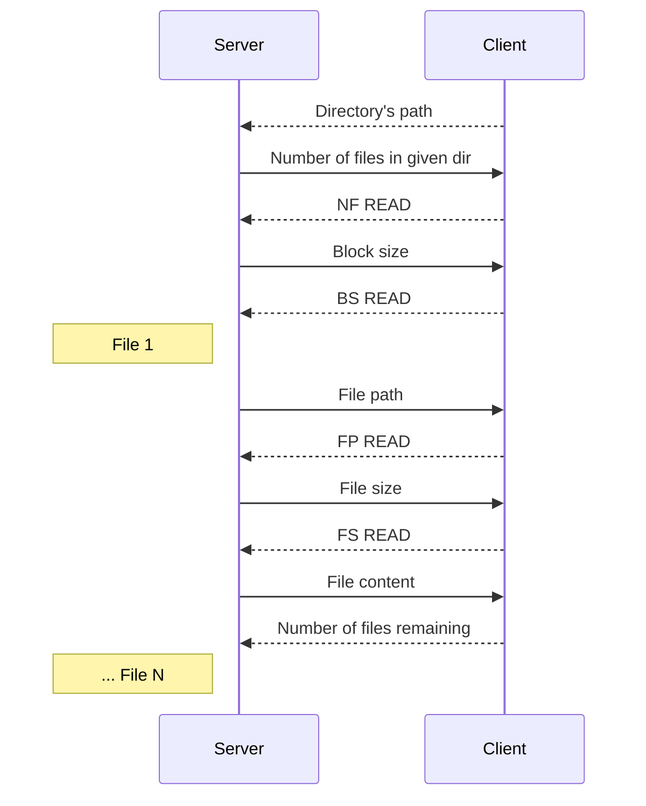

# Directory Clone Server

An FTP-like Server utilizing socket and thread programming with synchronization. A client makes a request to the server providing the server's directory to be cloned into results. A server can handle requests from multiple clients.

## Build and run instructions

- From the Project_2 directory run `make` to the executables
- From the Project_2 directory run `make clean` to clean the bin and the results folders

## Implementation details

The code contains pretty detailed comments, so what follow is an analysis of the main implementation decisions that were taken:

### Server logic

- Parse the arguments and make sure that they are correct
- Create queue of given size and initialize mutex and condition variables
- Create workers thread pool of given size with a routine called 'process'
- Create socket, bind it to specified port (use INADDR_ANY) and set the option to reuse it
- Repeatedly:
  - Listen for a new connection
  - Accept a connection
  - Create its corresponding communication thread with a routine called 'client_communication'

### Communication thread logic

- Detach thread
- Read the directory, if it is not valid send 'INVALID DIR', close fd and exit
- Find the number of files inside the directory, if even one directory - nested or not - cannot be opened send 'COULD NOT OPEN DIR/S', close fd and exit
- Send the number of files and wait for response ('NF READ')
- Send the block size and wait for response ('BS READ')
- Create and initialize client's mutex (each client has its own mutex)
- For each file inside the directory, wait for queue to be non-full and then insert its file info into the queue
- Exit

### Worker logic

- Detach thread
- Repeatedly:
  - Wait for queue to be non-empty
  - Get first non-empty item of queue
  - Send file's content
  - Destroy file info

### Client logic

- Parse the arguments and make sure they are correct
- Create socket, bind it to specified port (use server_ip) and connect to it
- Send directory to clone, if directory is not valid exit
- Read number of files the directory contains, if some directory couldn't be opened exit
- Create directory clone inside 'results'
- Send response ('NF READ')
- Read block size and send response ('BS READ')
- While there are files that remain to be received:
  - Receive file path and file size, create file and write to it the received content
  - Send remaining files
- Exit

## General notes

- Only the content of regular files is transferred - no pipes, links and hidden files
- If the requested directory is not valid the server sends 'INVALID DIR' to the client
- If the server does not have permissions to open the requested directory or any nested directory inside it, it sends 'COULD NOT OPEN DIR/S' to the client
- If an error occurs inside a communication thread the server closes the fd and exits the thread but does not terminate
- The requested directory must begin with '/'and have length > 1 (we ask for the dir to begin with '/' so that we can properly create a dir clone inside the results)
- The directories cloned are stored inside the results directory
- Each client has its own mutex, because only one worker must be able to sent a file to the client at any time - a different approach would be to have a mutex for all the clients
- The heap data from the queue and workers allocations do not get freed from the server process, that is because if the server receives a SIGINT signal it is difficult to handle that signal properly due to the usage of threads
- The contents of the queue (file_info objects) do get freed from the worker thread that process each one
- The dynamically allocated client mutex does get freed when all the files have been sent to the client
- The order in which the printed messages appear is not necessarily an indicator of the execution order

## Important note

- Client sends acknowledgement messages to the server after receiving different type of information (number of files, block size, file path, file size, content). This approach is used because we cannot safely assume that the write/read procedures to/from the socket from the server/client are going to be perfectly synchronized every time. For example it is possible that the client is having a small delay before reading from the socket the file path and the server proceeds normally, sending the file path and then the file size without waiting for a client's response. Then when the client reads from the socket, the buffer is going to contain both the file path and the file size but the client cannot be sure of the that. So instead of parsing each time the buffer with several cases taken into consideration, we opt to send an acknowledgement message (much like a tcp handshake).

---

## Communication Protocol Server-Client

